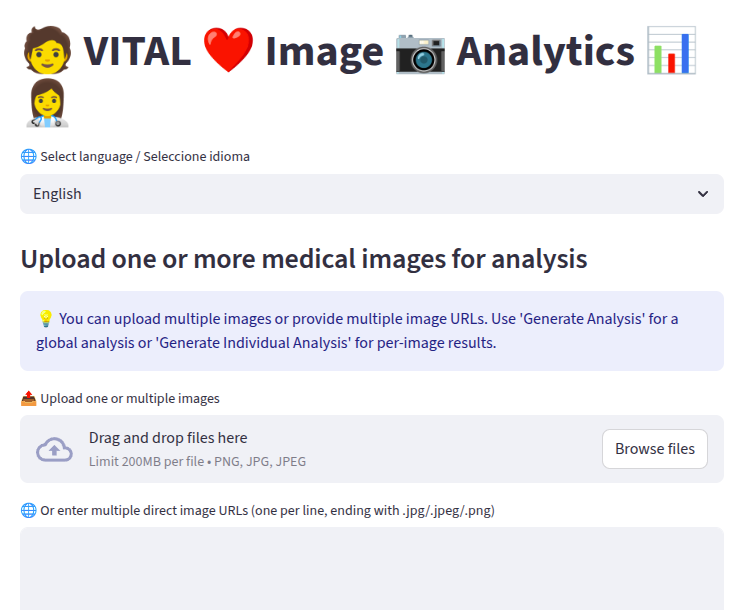

# VitalImage Analysis

**VitalImage Analysis** es una aplicación web desarrollada con **Streamlit** para el análisis de imágenes médicas usando la API **Gemini de Google**. Permite subir imágenes locales o ingresar URLs de imágenes, y generar análisis global o individual con resultados descargables en **TXT** y **PDF**.

---

## Vista previa de la app



---

## Funcionalidades

- Subir una o más imágenes médicas (.png, .jpg, .jpeg).
- Ingresar URLs directas de imágenes.
- Seleccionar idioma: **English** o **Español**.
- Generar análisis global de todas las imágenes.
- Generar análisis individual por imagen.
- Descargar resultados en **TXT** o **PDF**.

---

## Instalación

1. Clonar el repositorio:

```bash
git clone https://github.com/juanpyR/medical_analisis.git
cd medical_analisis
